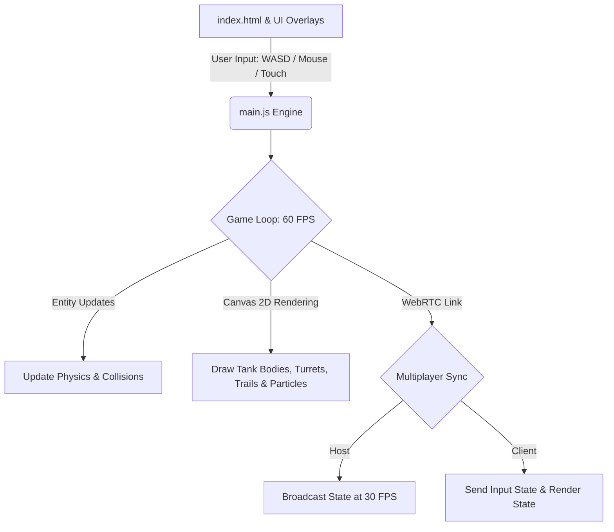

# PyroTankX 🚀
### Premium Serverless 2D Tank Shooter with P2P WebRTC Multiplayer

PyroTankX is a fast-paced, wave-based 2D tank shooter built with **HTML5 Canvas, CSS3, and JavaScript**, powered by the **Vite** build engine and integrated with **Vercel Speed Insights**.

---

## 📋 Table of Contents
- [🔍 Project Nature (Is it Frontend, Backend, or Full-Stack?)](#-project-nature-is-it-frontend-backend-or-full-stack)
- [🏗️ Architectural Overview](#-architectural-overview)
- [📂 Codebase Structure & File Analysis](#-codebase-structure--file-analysis)
- [🎮 Core Game Features](#-core-game-features)
- [🕹️ Controls](#-controls)
- [🛠️ Local Development & Deployment](#-local-development--deployment)

---

## 🔍 Project Nature: Is it Frontend, Backend, or Full-Stack?

PyroTankX is a **Serverless Frontend Web Application** featuring **P2P (Peer-to-Peer) Multiplayer**. 

* **No Dedicated Backend Server:** Instead of hosting a resource-heavy central multiplayer server (such as Node.js with Socket.io), the game uses **PeerJS (WebRTC)** to connect the two players' browsers **directly to each other**. 
* **Host-Client Architecture:**
  * **Host (Player 1):** The browser of the host acts as the "authority." It runs the master game loop, generates enemy pathfinding, detects collisions, manages spawns, registers damage, and processes wave changes. It then broadcasts the final coordinates of all entities (tanks, bullets, explosions, power-ups) to the client.
  * **Client (Player 2):** Connects to the host using a 4-letter room code. It reads the local inputs (keyboard, mouse, or touch controls), sends them to the host, and renders the entities based on the state updates it receives back.
* **Serverless Hosting:** Since the logic runs entirely in the browser, the project has zero hosting costs and can be served as a static site on platforms like **Vercel** or **GitHub Pages**.

---

## 🏗️ Architectural Overview

The project follows a standard modern game loop architecture tailored for the browser:



### 1. The Game Loop (`requestAnimationFrame`)
Runs at a locked **60 FPS** utilizing the browser's native frame-refresh loop. It coordinates:
* Input processing (keyboard listeners, mouse coordinates, and virtual joystick tracking).
* Physics update ticks (movement vectors, obstacle boundary limits).
* Drawing operations (clearing the canvas and drawing layers sequentially: background, power-ups, tanks, bullets, explosions, and visual status circles).

### 2. Entity Management
Built using structured ES6 classes:
* **`Player`**: Tracks coordinates, turret angle, armor health (HP), power-up states, and movement dynamics.
* **`Enemy`**: Controls automatic chase pathfinding to target the nearest player tank, random steering wobbles, and fire rate cooldown timers.
* **`Bullet`**: Computes ballistic trajectories and maintains trailing particle coordinates for visual ammunition tracers.
* **`PowerUp`**: Manages drop locations, item types (Shield, Rapid Fire, Armor Boost), and floating float-up animation loops.
* **`Explosion`**: Manages frame-by-frame expanding concentric fire rings when a tank is destroyed.

---

## 📂 Codebase Structure & File Analysis

The repository consists of clean, isolated configurations:

* **[index.html](file:///d:/Codes/PyroTankX-main/index.html)**: Declares the responsive DOM layout. Contains the HUD overlays (Score, Waves, dual Player Armor bars), screen layers (Start screen, Lobby connector, Game Over screen), and the canvas container.
* **[style.css](file:///d:/Codes/PyroTankX-main/style.css)**: Implements visual aesthetics. Includes:
  * Sleek Glassmorphism effects with glowing shadows (`backdrop-filter`).
  * CSS3 Keyframe animations for title glows, button hover scales, and pulsating wave banners.
  * Aspect-locked responsive scales to guarantee the game fits correctly on mobile viewports.
  * Sized controls for the mobile virtual joysticks and scoreboard panels.
* **[main.js](file:///d:/Codes/PyroTankX-main/main.js)**: The heart of the application. Contains the Canvas drawing logic, WebRTC event bindings, physics algorithms, and state machines.
* **[package.json](file:///d:/Codes/PyroTankX-main/package.json)**: Configured with Vite as the compiler, and `@vercel/speed-insights` for runtime telemetry.

---

## 🎮 Core Game Features

1. **Custom Name Setup:** Players can type in their preferred usernames. The names are synced over the network and drawn above the respective tanks on the screen.
2. **P2P Multiplayer:** Low-latency WebRTC data channels establish smooth multiplayer connectivity without setting up game servers.
3. **Responsive Virtual Joysticks:** Automatically displays touch inputs on mobile/tablet devices, allowing smooth 360-degree analog navigation and shooting.
4. **Three Power-up Modes:**
   * 🟢 **Armor Boost:** Recovers 2 units of damaged shield plates.
   * 🟡 **Rapid Fire:** Decreases bullet shooting delay from 18 frames down to 7 frames.
   * 🔵 **Visual Energy Shield:** Grants absolute invulnerability accompanied by a glowing visual forcefield around the tank.

---

## 🕹️ Controls

* **Desktop Controls:**
  * **Movement:** `W`, `A`, `S`, `D` or `Arrow Keys` (Move tank chassis & rotate tracks)
  * **Aiming:** Move mouse cursor to rotate turret head.
  * **Shooting:** `Left-Click` or `Spacebar` to fire.
* **Mobile / Touch Controls:**
  * **Left Virtual Joystick:** Move and steer.
  * **Right Action Button:** Press and hold to open fire.

---

## 🛠️ Local Development & Deployment

### Prerequisites
* [Node.js](https://nodejs.org/) (v16+)
* [npm](https://www.npmjs.com/)

### Installation & Launch
1. **Clone & Navigate:**
   ```bash
   git clone https://github.com/bvrao204/PyroTankX.git
   cd PyroTankX
   ```
2. **Install Dependencies:**
   ```bash
   npm install
   ```
3. **Launch Local Server:**
   ```bash
   npm run dev
   ```
   Open `http://localhost:5173` in your web browser.

4. **Compile Production Bundle:**
   ```bash
   npm run build
   ```
   Packs optimized static assets into the `/dist` directory for instant hosting on Vercel or Netlify.
